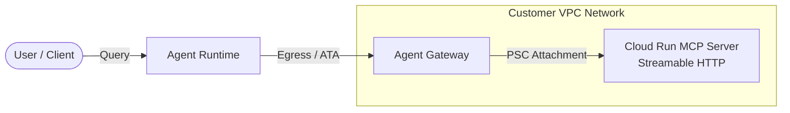

# MCP Client & Streamable HTTP Weather Server

This repository provides an integrated **Model Context Protocol (MCP)** solution featuring a **Streamable HTTP** FastMCP Weather Server deployed to **Cloud Run** and an MCP Client Agent running on **Agent Runtime**.



---

## 🚀 Architecture Overview

1. **Cloud Run MCP Server (`cloud_run/`)**:
   - Built using `FastMCP` and `mcp.streamable_http_app()`.
   - Exposes a unified `/mcp` HTTP endpoint supporting both HTTP/1.1 and HTTP/2 streaming.

2. **Agent Runtime (`agent.py`)**:
   - Built using the `LlmAgent` and `McpToolset` (`StreamableHTTPConnectionParams`).
   - Routes outbound tool execution requests securely through an **Agent Gateway**.

---

## 🛠️ Deployment Workflow

### 1. Deploy the Cloud Run Server
Navigate to `cloud_run/` and deploy the service:
```bash
cd cloud_run
gcloud run deploy mcp-weather-server \
  --source . \
  --region=us-east1 \
  --allow-unauthenticated
```
Once deployed, note the dynamic service URL (e.g., `https://mcp-weather-server-XXXXX.us-east1.run.app`).

---

### 2. Update the Client Agent Configuration (`agent.py`)
In `agent.py`, update the `url` parameter inside `StreamableHTTPConnectionParams` by appending `/mcp` to your Cloud Run URL:

```python
mcp_toolset = McpToolset(
    connection_params=StreamableHTTPConnectionParams(
        url="https://mcp-weather-server-XXXXX.us-east1.run.app/mcp",
    )
)
```

---

### 3. Configure Agent Gateway Routing
Ensure your [`.agent_engine_config.json`](.agent_engine_config.json) points to your managed Agent Gateway resource:

```json
{
  "identity_type": "AGENT_IDENTITY",
  "agent_gateway_config": {
    "agent_to_anywhere_config": {
      "agent_gateway": "projects/YOUR_PROJECT_ID/locations/us-east1/agentGateways/YOUR_GATEWAY_NAME"
    }
  }
}
```

---

### 4. Deploy to Agent Runtime
Deploy the Client Agent using the ADK CLI:

```bash
adk deploy agent_engine \
  --project=your-project-id \
  --region=us-east1 \
  --display_name="MCP Weather Client" \
  .
```

For complete VPC networking, Private Service Connect attachments, and DNS peering verification steps, reference [DEPLOYMENT.md](DEPLOYMENT.md).
